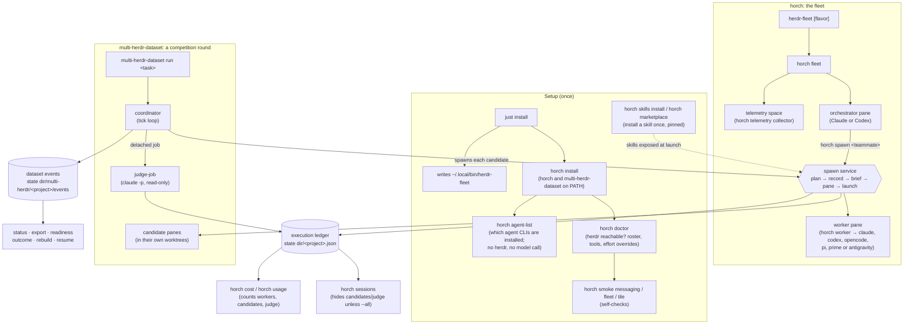
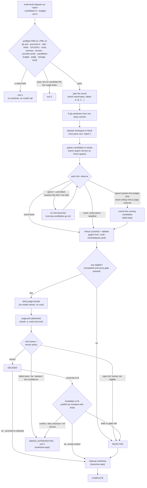
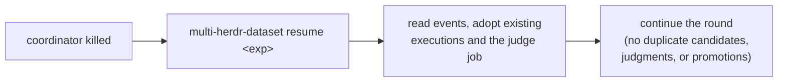
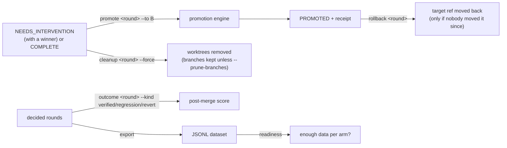

# How the commands fit together

Two binaries share one kernel. `horch` runs a fleet: one orchestrator that
spawns workers. `multi-herdr-dataset` runs a competition round: N candidates
and a judge. Both create executions through the same spawn service and write
them to the same execution ledger.

A worker or a candidate runs one of 6 agent CLIs: `claude`, `codex`,
`opencode`, `pi`, `prime` (binary `prime-agent`) or `antigravity` (binary
`agy`). `horch agent-list` shows which of them this machine has.

## 1. The big picture



`<project>` is a slug of the project path. The state dir is
`$HORCH_STATE_DIR`, else `${XDG_STATE_HOME:-~/.local/state}/horch`.
The data root (the skill store: marketplace skills and their lock) is
`$HORCH_DATA_DIR`, else `${XDG_DATA_HOME:-~/.local/share}/horch`.
`HORCH_DATA_DIR` names the store itself: horch does not append `horch`.

## 2. The fleet: orchestrator and workers

```mermaid
sequenceDiagram
    actor You
    participant O as Orchestrator pane
    participant H as horch (CLI)
    participant L as Ledger
    participant W as Worker pane

    You->>H: herdr-fleet (horch fleet)
    H->>L: insert orchestrator record
    H->>O: open pane, start Claude/Codex

    O->>H: horch sessions
    H-->>O: past workers, summaries, gotchas
    O->>H: horch route <teammate> (optional dry run)
    H-->>O: spawn, substitute a fallback, or refuse (exit 3)
    O->>H: horch spawn <teammate> "Read and follow plan.md"
    H->>H: plan: roster + quota/routing + skills (no I/O)
    H->>L: insert record (Planned)
    H->>W: write brief, split pane, run `horch worker`
    H->>L: Starting, pane id recorded
    W->>L: Running; session id recorded (minted or discovered)
    W->>W: agent works

    W->>H: horch note "progress"
    H->>L: append note
    W->>H: horch tell orchestrator "QUESTION: ..."
    H->>O: text arrives in the orchestrator pane
    O->>H: horch tell <role> "ANSWER: ..."  (or horch assign <role> "task")
    H->>W: text arrives in the worker pane

    W->>H: horch done "summary"
    H->>L: Done + summary
    H->>O: DONE message
    H->>W: start a detached re-tile, close the pane
```

### What a pane command carries

A pane is a fresh shell. It does not inherit the environment of the `horch`
that opened it, so the pane command carries what the pane must see. Every
pane command horch runs (`PaneShell::command_line_with_env` in
`crates/horch-core/src/workspace/paneshell.rs`) does 2 things first:

- It removes `ANTHROPIC_API_KEY`. The way depends on the pane shell
  (`paneshell.rs`):
  - Posix: the line starts with `exec /usr/bin/env -u <NAME>`. The `exec`
    replaces the pane's shell, so no pane process keeps the variable.
  - Posix, a pane that keeps its shell (`PaneShell::command_line_keep_shell`,
    used by smoke, which types more lines): the line starts with
    `unset <NAME>;`, so the shell drops the variable, and then runs
    `/usr/bin/env -u <NAME> ...` without `exec`.
  - PowerShell: the line starts with
    `Remove-Item Env:<NAME> -ErrorAction SilentlyContinue;`.
- It sets `HORCH_DATA_DIR` to the data root of the `horch` that opened the
  pane, so the pane, its agent and every `horch` command the agent runs use
  the same skill store.

The panes that get it:

| Pane | Command | Built in |
|---|---|---|
| orchestrator | `horch pane-launch` | `crates/horch/src/cmd/recipes.rs` |
| worker, dataset candidate | `horch worker <role>` | `crates/horch-core/src/execution/service.rs` |
| dataset round root pane | `multi-herdr-dataset watch` | `crates/horch/src/dataset/run.rs` |
| telemetry collector | `horch telemetry` | `crates/horch/src/cmd/telemetry.rs` |
| smoke checks | `horch register <role>` | `crates/horch/src/cmd/smoke.rs` |

The dataset judge is not a pane: `judge-job` is a detached child of the
coordinator, so it inherits the coordinator's environment.

The state dir travels separately: as `--state-dir` on the pane command when
you override it, and in the brief (`state_dir`) for a worker. The brief
carries the roster dir and the binary overrides too. The worker passes all
of them on to its agent as `HORCH_*` variables.

Side commands any time: `horch inbox` (live roles), `horch layout` /
`horch tile` / `horch balance` (the pane grid), `horch quota` (the usage
pools: claude, codex, opencode-zen, google, local), `horch agent-list` (the
agent CLIs, their versions and pool state), `horch spawn --resume <id>`
(continue an old worker's session).

An `antigravity` worker draws on the `google` pool. That pool has no probe, so
`horch quota` shows it as `unknown`. `horch cost` cannot price an
`antigravity` session: `agy` writes no local usage file.

## 3. A dataset round



Preflight PRE-09 projects each candidate's cost from the first source that
has its expected tokens: `budget.expected_tokens` in
`.multi-herdr/dataset.yaml` (per model, then `all`), then the measured usage
of at least 3 earlier candidates of the same task on the same model, then a
fixed default ($1.60 for a sonnet candidate). The PRE-09 detail names the
source of each candidate. Keys and rules: dataset design §4.11.1. Every
`dataset.yaml` key with its default: [dataset-config.md](dataset-config.md).

The last line of `run` names the outcome, and the exit code follows it:

| outcome | exit |
|---|---|
| DECIDED or PROMOTED (the round then reaches COMPLETE) | 0 |
| REJECTED because the budget stopped the candidates | 3 |
| NEEDS_INTERVENTION | 5 |
| REJECTED for any other reason | 6 |

Source: `outcome_line` in `crates/horch/src/dataset/run.rs`; the codes are in
`crates/horch/src/dataset/mod.rs` (`exit`).

### Which repo a dataset command targets

Every `multi-herdr-dataset` command (except the hidden `judge-job`) picks its
repo in this order:

1. `--project <dir>` (a global flag; a relative dir is relative to the cwd);
2. the git top level of the current directory;
3. `$HORCH_PROJECT_DIR`, only when the current directory is in no git repo;
4. the current directory.

A fleet pane sets `HORCH_PROJECT_DIR` to the fleet's repo. Rule 2 makes `cd
<other repo> && multi-herdr-dataset run ...` target the other repo.
`run`, `resume`, `status`, `promote`, `rollback` and `cleanup` print
`target: <repo> @ <HEAD, 12 chars>` as their first line, before preflight.
Source: `resolve_project` in `crates/horch/src/dataset/mod.rs`.

### Where the candidate worktrees go

Each candidate worktree is at `<root>/<experiment id>/<label>`, such as
`<root>/0199a5b0-.../A`. A promotion checks out its temp worktree under
`<root>/<experiment id>/_promote/`.

- Without `--worktree-root`, `<root>` is `<dataset root>/worktrees`
  (`<state root>/multi-herdr/<project slug>/worktrees`).
- `--worktree-root <dir>` sets `<root>`. A relative dir is relative to the
  repo. Put it under a directory that the candidate harnesses trust, or a
  candidate pane can stop at a trust dialog (dataset design §4.11.3).

Cleanup removes each worktree and keeps its branch
(`mh/exp/<exp8>/r<index>/<label>`; `cleanup --prune-branches` deletes it).
After a COMPLETE round it also removes `<root>/<experiment id>/_promote/`
and `<root>/<experiment id>/` when they are empty. A directory with
anything left in it stays.

`status` shows each experiment at the state of its latest round (such as
RUNNING or COMPLETE); before its first round, at its own state (PREFLIGHT,
ABORTED or PLANNED).

Every arrow above is recorded as an event. After a crash or `kill -9`:



## 4. After a round (operator commands)

`promote`, `rollback` and `cleanup` are hidden from `--help`, but they work.



## Together or apart

| Command | Needs a herdr server | Needs a fleet | Spends model money |
|---|---|---|---|
| `horch fleet` / `herdr-fleet` | yes | no (it creates one) | yes, the orchestrator |
| `horch spawn`, `tell`, `assign`, `inbox`, `tile` | yes | run inside a fleet pane | `spawn` does |
| `horch done` | yes | run by a worker | no |
| `horch note` | no (it writes the ledger only) | run by a worker | no |
| `horch sessions`, `cost`, `usage`, `quota`, `route` | no | no | no (`quota --refresh` probes) |
| `horch agent-list` | no | no | no (it runs each agent CLI's `--version` unless `--no-probe`) |
| `multi-herdr-dataset run` / `resume` | yes | no (own workspace) | yes, candidates and judge |
| `multi-herdr-dataset status`, `export`, `readiness`, `outcome`, `rebuild` | no | no | no |
| `multi-herdr-dataset promote`, `rollback`, `cleanup` | no | no | no (git, plus the gates on a promote) |

The two systems run independently. A dataset round does not need a fleet,
and it never messages the fleet's orchestrator. What they share is the spawn
service and the execution ledger, so `horch cost` counts candidates and the
judge. `horch sessions` hides candidates and the judge unless you pass `--all`.
