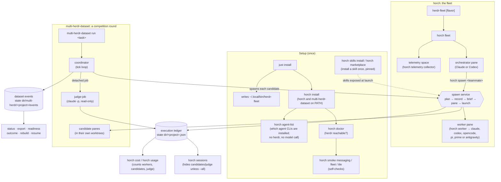
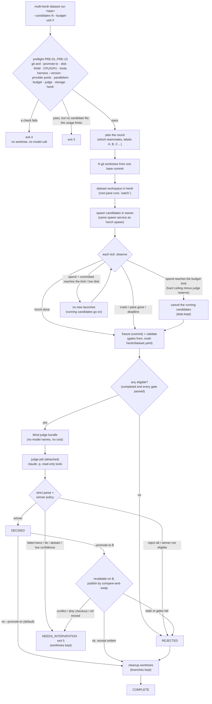
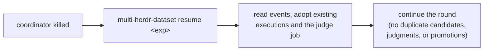
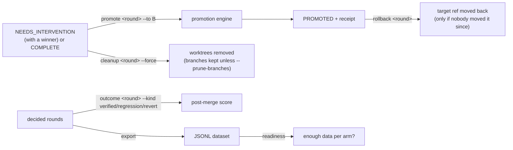

# How the commands fit together

Two binaries share one kernel. `horch` runs a fleet: one orchestrator that
spawns workers. `multi-herdr-dataset` runs a competition round: N candidates
and a judge. Both create executions through the same spawn service and write
them to the same execution ledger.

A worker or a candidate runs one of 6 agent CLIs: `claude`, `codex`,
`opencode`, `pi`, `prime` (binary `prime-agent`) or `antigravity` (binary
`agy`). `horch agent-list` shows which of them this machine has.

## 1. The big picture



`<project>` is a slug of the project path. The state dir is
`$HORCH_STATE_DIR`, else `${XDG_STATE_HOME:-~/.local/state}/horch`.

## 2. The fleet: orchestrator and workers

```mermaid
sequenceDiagram
    actor You
    participant O as Orchestrator pane
    participant H as horch (CLI)
    participant L as Ledger
    participant W as Worker pane

    You->>H: herdr-fleet (horch fleet)
    H->>L: insert orchestrator record
    H->>O: open pane, start Claude/Codex

    O->>H: horch sessions
    H-->>O: past workers, summaries, gotchas
    O->>H: horch route <teammate> (optional dry run)
    H-->>O: spawn, substitute a fallback, or refuse (exit 3)
    O->>H: horch spawn <teammate> "Read and follow plan.md"
    H->>H: plan: roster + quota/routing + skills (no I/O)
    H->>L: insert record (Planned)
    H->>W: write brief, split pane, run `horch worker`
    H->>L: Starting, pane id recorded
    W->>L: Running; session id recorded (minted or discovered)
    W->>W: agent works

    W->>H: horch note "progress"
    H->>L: append note
    W->>H: horch tell orchestrator "QUESTION: ..."
    H->>O: text arrives in the orchestrator pane
    O->>H: horch tell <role> "ANSWER: ..."  (or horch assign <role> "task")
    H->>W: text arrives in the worker pane

    W->>H: horch done "summary"
    H->>L: Done + summary
    H->>O: DONE message
    H->>W: start a detached re-tile, close the pane
```

Side commands any time: `horch inbox` (live roles), `horch layout` /
`horch tile` / `horch balance` (the pane grid), `horch quota` (the usage
pools: claude, codex, opencode-zen, google, local), `horch agent-list` (the
agent CLIs, their versions and pool state), `horch spawn --resume <id>`
(continue an old worker's session).

An `antigravity` worker draws on the `google` pool. That pool has no probe, so
`horch quota` shows it as `unknown`. `horch cost` cannot price an
`antigravity` session: `agy` writes no local usage file.

## 3. A dataset round



The last line of `run` names the outcome, and the exit code follows it:

| outcome | exit |
|---|---|
| DECIDED or PROMOTED (the round then reaches COMPLETE) | 0 |
| REJECTED because the budget stopped the candidates | 3 |
| NEEDS_INTERVENTION | 5 |
| REJECTED for any other reason | 6 |

Source: `outcome_line` in `crates/horch/src/dataset/run.rs`; the codes are in
`crates/horch/src/dataset/mod.rs` (`exit`).

Every arrow above is recorded as an event. After a crash or `kill -9`:



## 4. After a round (operator commands)

`promote`, `rollback` and `cleanup` are hidden from `--help`, but they work.



## Together or apart

| Command | Needs a herdr server | Needs a fleet | Spends model money |
|---|---|---|---|
| `horch fleet` / `herdr-fleet` | yes | no (it creates one) | yes, the orchestrator |
| `horch spawn`, `tell`, `assign`, `inbox`, `tile` | yes | run inside a fleet pane | `spawn` does |
| `horch done` | yes | run by a worker | no |
| `horch note` | no (it writes the ledger only) | run by a worker | no |
| `horch sessions`, `cost`, `usage`, `quota`, `route` | no | no | no (`quota --refresh` probes) |
| `horch agent-list` | no | no | no (it runs each agent CLI's `--version` unless `--no-probe`) |
| `multi-herdr-dataset run` / `resume` | yes | no (own workspace) | yes, candidates and judge |
| `multi-herdr-dataset status`, `export`, `readiness`, `outcome`, `rebuild` | no | no | no |
| `multi-herdr-dataset promote`, `rollback`, `cleanup` | no | no | no (git, plus the gates on a promote) |

The two systems run independently. A dataset round does not need a fleet,
and it never messages the fleet's orchestrator. What they share is the spawn
service and the execution ledger, so `horch cost` counts candidates and the
judge. `horch sessions` hides candidates and the judge unless you pass `--all`.
